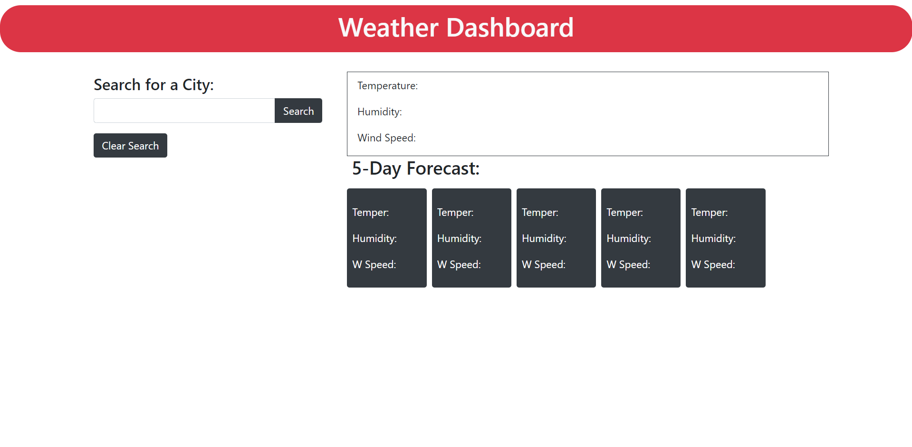

# weather-dashboard

## Link to Deployed Application

https://tigergiangnguyen.github.io/weather-dashboard/

## Screenshot of Deployed Application



## User Story

```
AS A traveler
I WANT to see the weather outlook for multiple cities
SO THAT I can plan a trip accordingly
```

## Acceptance Criteria

```
GIVEN a weather dashboard with form inputs
WHEN I search for a city
THEN I am presented with current and future conditions for that city and that city is added to the search history
WHEN I view current weather conditions for that city
THEN I am presented with the city name, the date, an icon representation of weather conditions, the temperature, the humidity, and the wind speed
WHEN I view future weather conditions for that city
THEN I am presented with a 5-day forecast that displays the date, an icon representation of weather conditions, the temperature, the wind speed, and the humidity
WHEN I click on a city in the search history
THEN I am again presented with current and future conditions for that city
```

## Description

Give instructions to build a working weather website that takes an api to run weather conditions real time. This assignment was landed on an even week therefore no starter code was given. This weather website is all run through Open Weather Map API(Application Program Interface) where I get data from and apply it to the HTML. When the user enters a valid city, Javascript will make a fetch to the API with data. The HTML will display current day weather conditions, temperature, wind speed, humidity, and a small image to show the user visually how that weather condition will look like on that day and searches 5 day after that day with the same results according to those future days. The user can search mutiple different cities and each valid cities searched is store in local storage as a value and show a recent seaches the user made below the search, the user may click on a recent search and will run that value as a new search. Learning data fetching is a great tool to use and further my knowledge in my arsenal.

## Credits

 - Openweathermap (API)
 - Bootstrap
 - JQuery
 - https://www.linkedin.com/in/tylo-moua-76286416b/

## License

MIT License